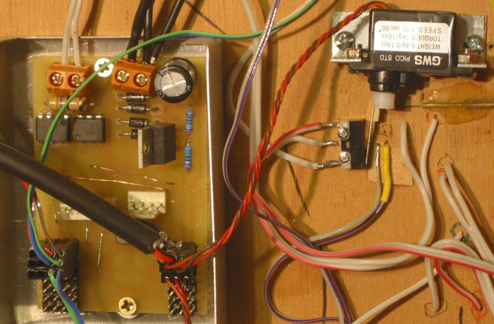
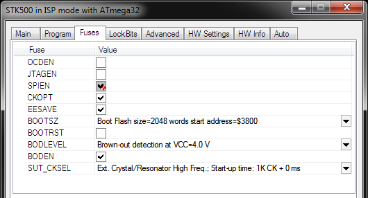

# DCC Servo Decoder

I built the servo decoder to switch my hand laid turnouts.  I looked at the standard solutions, such as
[the tortoise](http://www.circuitron.com/index_files/Tortoise.htm), but they were enormous for a z-scale layout.
 
I planned to use ultra-miniature rc servos to do the switching.

## Functionality
<ol>
    <li>Drive up to 8 RC servos to simulate the opening and closing of a turnout.</li>
    <li>Provide outputs for each servo to control the signal lights surrounding the turnout.
        <ul>
            <li>Support for individual, bicolour and tricolour LEDs</li>
        </ul>
    </li>
    <li>Controlled by DCC</li>
    <li>Supports configuration variables with acknowledgement
        <ul>
            <li>Accessory Address Lo</li>
            <li>Accessory Address Hi</li>
            <li>Configuration byte</li>
            <li>Interactive Programming Address</li>
            <li>Enable Interactive Servo</li>
            <li>And for each servo,
                <ul>
                    <li>Servo Min position</li>
                    <li>Servo Max position</li>
                    <li>Servo switching time</li>
                    <li>Servo Configuration byte</li>
                </ul>
            </li>
        </ul>
    </li>
    <li>Support a simulated "run" where adjusting the accessory "speed" sets the min/max positions of the turn out.</li>
</ol>

## Design

The electronics design is quite simple. The original v1.0 schematic is shown below (click on it for the pdf)

Things of interest...

* U4 is a high speed opto-coupler used to read the signal transmitted in the track lines.
* U5 and Q1 are used to load the track (draw more than ?mA). This is how the DCC accessory acknowledges commands.
* J4, is the RS232 TTL connector is for debug.
* J1 provides power for the module. I prefer a separate supply, rather than using the track power, but the track power can be used here.
* U1 provides 5v power for the the microcontroller.
* U2 provides adjustable power for the servos. This is currently set to 5.75v.
* JP5, JP6, JP7 provides drive for 8 servos, a signal wire, plus power and ground.
* JP1, JP2, JP3, JP4 provides the drive for the signalling LEDs, an open signal, a closed signal, power and ground.

The PCB for the home etched PCB is here...
				

Here's an action shot of the PCB, wired up to 3 turnouts and signal LEDs. This is from my
[Test Layout](http://www.franksworkshop.com.au/ModelRail/TestLayout/TestLayout.htm).

## Firmware
The important interfacing is done via interrupts.

The DCC input signal is picked up and decoded in the External 
Interrupt 0 handler. The interrupt triggers on any change, 
so the interrupt handler is called twice for each bit. Each transition is timed using 16bit 
Timer2. A short time is a 1. A long time is a 0. 
The time is checked to fit in a min/max range for each of 0 and 1. 
If the time falls outside this range, it is an error 
and the packet is discarded. A completed packet is stored 
in an array and a global flag is set to let the main loop know 
to process it.

Timer 0 fires every 2.5ms. This is to start a new servo 
output. Because the servo signal only lasts 2ms and is 
repeated every 20ms, we can service all 8 servos sequentially in 
20ms, every 2.5ms. The interrupt also updates the position 
of any servos in motion every 1/10th	of a second.

The servo pulse is started in the timer 0 interrupt by 
starting the timer 1 counter and outputting a value to the servo 
signal line. The output compare register is used to time 
the servo pulse. When the output compare interrupt 
triggers, the pulse is set to 0. This is not a good way of 
doing this because delays to the interrupt (for example, it is 
busy processing another interrupt), can cause jitter. A 
better way would be to use the output compare feature to set the 
signal to 0, but there are not 8 lines that do that.

The main loop is responsible for processing any packets that 
have been received from the DCC bus. This include CV 
changes, and operation changes. Opening and closing the 
turnouts is initiated by the main loop. The main loop 
updates the signalling LEDs.

The source for the firmware can be found here in the [Firmware directory](./Firmware).
  
I must apologise for this code. It hasn't been touched for 
many years, lacks comments, and it's full of magic numbers and 
debug. 

I program the device and the fuses using AVRStudio and an AVRISP clone.  
The fuses are set to...

## Interface
The interface to the Servo Decode is a standard DCC Accessory 
(as far as I could interpret the standard).

The device is configured via configuration variables. 
These are listed below...

<table border="1" id="table1">
	<colgroup>
		<col width="50"/>	
	</colgroup>
	<tr>
		<td>CV</td>
		<td>Description</td>
	</tr>
	<tr>
		<td>513</td>
		<td>Accessory Address LSB </td>
	</tr>
	<tr>
		<td>514</td>
		<td>Accessory Address MSB</td>
	</tr>
	<tr>
		<td>515</td>
		<td>Configuration byte. Currently none of the bits 
		are used.</td>
	</tr>
	<tr>
		<td>545</td>
		<td>Servo 1 min position. The position the servo 
		should move to when the turnout is closed.</td>
	</tr>
	<tr>
		<td>546</td>
		<td>Servo 1 max position. The position the servo 
		should move to when the turnout is open.</td>
	</tr>
	<tr>
		<td>547</td>
		<td>Servo 1 switch time. The time, in tenths of a 
		second, that it takes the turnout to close.</td>
	</tr>
	<tr>
		<td>548</td>
		<td>Servo 1 configuration byte. Bit 0 - Reverse 
		turnout open/close direction. Bit 1 - Reverse the 
		LED outputs. Bit 2 - LED is a tricolour LED.</td>
	</tr>
	<tr>
		<td>549</td>
		<td>Servo 2 min position. The position the servo 
		should move to when the turnout is closed.</td>
	</tr>
	<tr>
		<td>550</td>
		<td>Servo 2 max position. The position the servo 
		should move to when the turnout is open.</td>
	</tr>
	<tr>
		<td>551</td>
		<td>Servo 2 switch time. The time, in tenths of a 
		second, that it takes the turnout to close.</td>
	</tr>
	<tr>
		<td>552</td>
		<td>Servo 2 configuration byte. Bit 0 - Reverse 
		turnout open/close direction. Bit 1 - Reverse the 
		LED outputs. Bit 2 - LED is a tricolour LED.</td>
	</tr>
	<tr>
		<td>553</td>
		<td>Servo 3 min position. The position the servo 
		should move to when the turnout is closed.</td>
	</tr>
	<tr>
		<td>554</td>
		<td>Servo 3 max position. The position the servo 
		should move to when the turnout is open.</td>
	</tr>
	<tr>
		<td>555</td>
		<td>Servo 3 switch time. The time, in tenths of a 
		second, that it takes the turnout to close.</td>
	</tr>
	<tr>
		<td>556</td>
		<td>Servo 3 configuration byte. Bit 0 - Reverse 
		turnout open/close direction. Bit 1 - Reverse the 
		LED outputs. Bit 2 - LED is a tricolour LED.</td>
	</tr>
	<tr>
		<td>557</td>
		<td>Servo 4 min position. The position the servo 
		should move to when the turnout is closed.</td>
	</tr>
	<tr>
		<td>558</td>
		<td>Servo 4 max position. The position the servo 
		should move to when the turnout is open.</td>
	</tr>
	<tr>
		<td>559</td>
		<td>Servo 4 switch time. The time, in tenths of a 
		second, that it takes the turnout to close.</td>
	</tr>
	<tr>
		<td>560</td>
		<td>Servo 4 configuration byte. Bit 0 - Reverse 
		turnout open/close direction. Bit 1 - Reverse the 
		LED outputs. Bit 2 - LED is a tricolour LED.</td>
	</tr>
	<tr>
		<td>561</td>
		<td>Servo 5 min position. The position the servo 
		should move to when the turnout is closed.</td>
	</tr>
	<tr>
		<td>562</td>
		<td>Servo 5 max position. The position the servo 
		should move to when the turnout is open.</td>
	</tr>
	<tr>
		<td>563</td>
		<td>Servo 5 switch time. The time, in tenths of a 
		second, that it takes the turnout to close.</td>
	</tr>
	<tr>
		<td>564</td>
		<td>Servo 5 configuration byte. Bit 0 - Reverse 
		turnout open/close direction. Bit 1 - Reverse the 
		LED outputs. Bit 2 - LED is a tricolour LED.</td>
	</tr>
	<tr>
		<td>565</td>
		<td>Servo 6 min position. The position the servo 
		should move to when the turnout is closed.</td>
	</tr>
	<tr>
		<td>566</td>
		<td>Servo 6 max position. The position the servo 
		should move to when the turnout is open.</td>
	</tr>
	<tr>
		<td>567</td>
		<td>Servo 6 switch time. The time, in tenths of a 
		second, that it takes the turnout to close.</td>
	</tr>
	<tr>
		<td>568</td>
		<td>Servo 6 configuration byte. Bit 0 - Reverse 
		turnout open/close direction. Bit 1 - Reverse the 
		LED outputs. Bit 2 - LED is a tricolour LED.</td>
	</tr>
	<tr>
		<td>569</td>
		<td>Servo 7 min position. The position the servo 
		should move to when the turnout is closed.</td>
	</tr>
	<tr>
		<td>570</td>
		<td>Servo 7 max position. The position the servo 
		should move to when the turnout is open.</td>
	</tr>
	<tr>
		<td>571</td>
		<td>Servo 7 switch time. The time, in tenths of a 
		second, that it takes the turnout to close.</td>
	</tr>
	<tr>
		<td>572</td>
		<td>Servo 7 configuration byte. Bit 0 - Reverse 
		turnout open/close direction. Bit 1 - Reverse the 
		LED outputs. Bit 2 - LED is a tricolour LED.</td>
	</tr>
	<tr>
		<td>573</td>
		<td>Servo 8 min position. The position the servo 
		should move to when the turnout is closed.</td>
	</tr>
	<tr>
		<td>574</td>
		<td>Servo 8 max position. The position the servo 
		should move to when the turnout is open.</td>
	</tr>
	<tr>
		<td>575</td>
		<td>Servo 8 switch time. The time, in tenths of a 
		second, that it takes the turnout to close.</td>
	</tr>
	<tr>
		<td>576</td>
		<td>Servo 8 configuration byte. Bit 0 - Reverse 
		turnout open/close direction. Bit 1 - Reverse the 
		LED outputs. Bit 2 - LED is a tricolour LED.</td>
	</tr>
	<tr>
		<td>577</td>
		<td>Interactive programming address.</td>
	</tr>
	<tr>
		<td>578</td>
		<td>Enable Interactive servo. When this variable 
		is set to non-zero, the accessory decoder will start 
		treating the accessory as a locomotive, listening for 
		7-bit speed commands on the address specified in CV577. 
		If a speed is detected, it is used to set the position 
		of the servo arm. The servo is selected by the 
		non-zero value of CV578 (this CV). If the turnout 
		is open, the open value (max) is set. It the 
		turnout is closed, the closed (min) value is set. 
		The min/max values will only be stored when this CV, 
		CV578 is set back to 0.</td>
	</tr>
</table>

The normal operation accessory decode packet is shown below...

    {preamble} 0 10AAAAAA 0 1AAACDDD 0 EEEEEEEE 1

Bit C is used open and close a turnout. DDD is used to select a 
servo. The DCC specification suggests that accessory outputs are 
paired so that the lowest D bit selects the output, and the upper two D 
bits select 1 of 4 devices. I just use the whole 3 bits to select 
one of 8 devices. I don't have a commercial DCC controller so I 
can't confirm this works elsewhere.

				
				
## Wiring
Here's a diagram of the wiring options...

Servos are easy. They just plug in.
There are many signalling options...

<ul>
	<li>No signalling</li>
	<li>Separate On/Off LEDs (where on is an open turnout, and off is a closed turnout)</li>
	<li>Bicolour LEDs. These LEDs have 2 legs: power them in one direction and they show one colour. Reverse the polarity and they show another colour.</li>
	<li>Tricolour LEDs. These are effectively 2 LEDs in the one body. One leg for each colour and a common ground (cathode). Three colour combinations can be  made by lighting LED A, LED B, or both A and B.</li>
	<li>Only one LED on the on or off lines.</li>
</ul>

LEDs can also be connected in parallel to have more lights, or redundant signals.

A current limiting resistor must be installed. The LEDs 
are driven directly from the microcontroller pins. They 
must be limited to 20mA each, according to the Atmel spec.

## Next Version

A few improvements are necessary...

<ul>
	<li>Moving the servo arm is very noisy (audible). I'd 
	like to try changing the voltage on the servos to see if 
	lowering it would make a difference. Some micro servos 
	work down to 3.0 volts.</li>
    <li>The servos seem very susceptible to electrical noise. 
    I reduced this by putting the PCB in a metal box, and using 
    shielded servo cables. I need to look into this.</li>
	<li>A pretty LED or two to show the device is powered up, 
	and flash it to acknowledge commands.</li>
    <li>Servos are usually highly geared, such that there is no need 
    to continue providing power to hold the position. Maybe 
    just removing the positioning signal will work.</li>
	<li>Rethink how to generate the servo timing signals. 
	The timing seems to be a bit in accurate making the servos 
	jiggle - maybe using a timer output and a 1-in-8 decoder.</li>
</ul>
